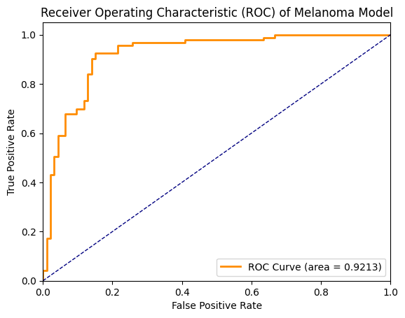
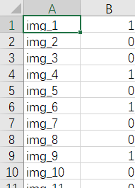

# Melanoma-Discriminator
Decide whether an image is a melanoma.

Created by <a href="mailto:petershen815@126.com">Peter S</a> on Aug 11th, 2020

<br>

## How to Run

### As a Start - Dataset Management

Before running the code, the data should be grouped together as follow:

```bash
group1@nb1421:~/progress/Melanoma-Discriminator/code$ ls -lh DataSet/
total 96K
drwxrwxr-x 2 group1 group1  12K Aug 12 21:41 Test_set
drwxrwxr-x 2 group1 group1  20K Aug  9 14:04 Training_set
drwxrwxr-x 2 group1 group1 4.0K Aug  9 14:06 Validation_set
-rw-rw-r-- 1 group1 group1  378 Aug 20 19:47 mappings.json
-rw-rw-r-- 1 group1 group1 6.9K Aug 12 21:42 test_set.csv
-rw-rw-r-- 1 group1 group1  36K Aug  9 14:23 training_set.csv
-rw-rw-r-- 1 group1 group1 9.0K Aug  9 14:30 validation_set.csv
```

Note that the `mappings.json` should be put into the dataset folder.

---

### Main - `MelanomaDiscriminator.py`

There are a set of command-line arguments which you can customize to run the program with different parameter settings:

```bash
usage: MelanomaDiscriminator.py [-h] [-lr LEARNING_RATE] [-me MAX_STEPS]
                                [-ef EVAL_FREQ] [-bs MINIBATCH_SIZE]
                                [-opt OPTIMIZER] [-dr DATA_DIR] [-log LOG]
                                [-c CORES] [-gpu GPU] [-ev EFNET_VERSION]
                                [-rs RESIZE] [-dh DRAW_HAIR] [-net NETWORK]
                                [-m MODE] [-e EVAL] [-meta USE_META]

optional arguments:
  -h, --help            show this help message and exit
  -lr LEARNING_RATE, --learning_rate LEARNING_RATE
                        Learning rate, default = 0.0001
  -me MAX_STEPS, --max_steps MAX_STEPS
                        Number of epochs to run the trainer, default = 75
  -ef EVAL_FREQ, --eval_freq EVAL_FREQ
                        Frequency of evaluation on the validation set, default
                        = 5
  -bs MINIBATCH_SIZE, --minibatch_size MINIBATCH_SIZE
                        Size of a minibatch, default = 32
  -opt OPTIMIZER, --optimizer OPTIMIZER
                        Optimizer to be used [ADAM, RMSprop, ADAMW], default =
                        ADAMW
  -dr DATA_DIR, --data_dir DATA_DIR
                        Root directory of the input data, default = DataSet
  -log LOG, --log LOG   Specify where to create a log file. If log files are
                        not wanted, value will be None
  -c CORES, --cores CORES
                        number of workers (cores used), default = 4
  -gpu GPU, --gpu GPU   Specify whether to use GPU, default = 1
  -ev EFNET_VERSION, --efnet_version EFNET_VERSION
                        The version of EfficientNet to be used, default = 1
  -rs RESIZE, --resize RESIZE
                        The resized size of image, default = 240
  -dh DRAW_HAIR, --draw_hair DRAW_HAIR
                        Specify whether to draw pseudo-hairs in images,
                        default = 1
  -net NETWORK, --network NETWORK
                        Specify which model/network to use, default =
                        EfficientNet
  -m MODE, --mode MODE  Specify which mode the discriminator runs in (train,
                        eval), default = train
  -e EVAL, --eval EVAL  Specify the location of saved network to be loaded for
                        evaluation, default = eval
  -meta USE_META, --use_meta USE_META
                        Specify whether to use meta, default = 0
```

Examples of using this **main** program is as follow:

1.  Train on EfficientNet with metadata, using 10 CPU cores

    ```bash
    python MelanomaDiscriminator.py -c 10 -m train -net EfficientNet -meta 1
    ```

    And the output message is as follow:

    ```bash
    2020-08-21 08:29:25.702956: Loading Melanoma Dataset...
    2020-08-21 08:29:25.735592: Initializing the Training Model...
    2020-08-21 08:29:25.952732: Using EfficientNet 1, images resized to size = 240
    2020-08-21 08:29:26.068617: device: cuda:0
    2020-08-21 08:29:31.202079: Training Model sent to CUDA
    2020-08-21 08:29:31.202216: learning_rate = 0.0001, max_epoch = 75, num_workers = 10
    2020-08-21 08:29:31.202342: eval_freq = 5, minibatch_size = 32, optimizer = AdamW (
    Parameter Group 0
        amsgrad: False
        betas: (0.9, 0.999)
        eps: 1e-08
        lr: 0.0001
        weight_decay: 0.01
    )
    2020-08-21 08:29:31.202493: train_transform = Compose(
        DrawHair(hairs=4, width=(1, 2))
        RandomResizedCrop(size=(240, 240), scale=(0.9, 1.0), ratio=(0.75, 1.3333), interpolation=PIL.Image.BILINEAR)
        ToTensor()
        Normalize(mean=[0.485, 0.456, 0.406], std=[0.229, 0.224, 0.225])
    ), eval_transform = Compose(
        Resize(size=(240, 240), interpolation=PIL.Image.BILINEAR)
        ToTensor()
        Normalize(mean=[0.485, 0.456, 0.406], std=[0.229, 0.224, 0.225])
    )
    2020-08-21 08:29:31.202529: Using meta: True
    2020-08-21 08:29:31.202539: Start Training!
    2020-08-21 08:29:31.202549: ------------------------------------------------------------
    2020-08-21 08:29:46.981571: Training Round 0: acc = 63.90%, loss = 0.6789
    2020-08-21 08:30:02.931789: Training Round 1: acc = 76.60%, loss = 0.6019
    2020-08-21 08:30:17.923829: Training Round 2: acc = 82.75%, loss = 0.4732
    2020-08-21 08:30:32.826252: Training Round 3: acc = 85.43%, loss = 0.3533
    2020-08-21 08:30:49.015824: Training Round 4: acc = 91.04%, loss = 0.2491
    2020-08-21 08:30:58.656274: !!! Validation : acc = 74.73%, roc_auc = 83.05% !!!
    2020-08-21 08:30:58.818630: Model: model/20200821_08_29_25.pth has been saved.
    2020-08-21 08:31:15.273997: Training Round 5: acc = 93.45%, loss = 0.1873
    2020-08-21 08:31:30.745367: Training Round 6: acc = 95.32%, loss = 0.1365
    2020-08-21 08:31:45.456894: Training Round 7: acc = 96.66%, loss = 0.1128
    2020-08-21 08:32:01.087870: Training Round 8: acc = 96.52%, loss = 0.0875
    2020-08-21 08:32:17.213196: Training Round 9: acc = 97.59%, loss = 0.0779
    2020-08-21 08:32:26.344527: !!! Validation : acc = 77.96%, roc_auc = 86.48% !!!
    2020-08-21 08:32:26.514713: Model: model/20200821_08_29_25.pth has been saved.
    2020-08-21 08:32:42.556021: Training Round 10: acc = 98.26%, loss = 0.0580
    2020-08-21 08:32:58.241504: Training Round 11: acc = 98.40%, loss = 0.0637
    2020-08-21 08:33:12.383726: Training Round 12: acc = 98.26%, loss = 0.0685
    2020-08-21 08:33:27.891398: Training Round 13: acc = 99.20%, loss = 0.0389
    2020-08-21 08:33:43.343630: Training Round 14: acc = 98.40%, loss = 0.0483
    2020-08-21 08:33:52.754564: !!! Validation : acc = 87.63%, roc_auc = 92.13% !!!
    2020-08-21 08:33:52.902419: Model: model/20200821_08_29_25.pth has been saved.
    2020-08-21 08:34:08.516468: Training Round 15: acc = 99.20%, loss = 0.0288
    ...
    ...
    ...
    2020-08-21 08:51:08.516366: Training Round 74: acc = 99.87%, loss = 0.0051
    2020-08-21 08:51:18.266707: !!! Validation : acc = 79.57%, roc_auc = 89.78% !!!
    ```

    Additionally, a log file (e.g., `20200821_08_29_25.log`) and a best model file (e.g., `20200821_08_29_25.pth`) will be generated separately in the `log` folder and the `model` folder.

2.  Evaluate on `model/20200821_08_29_25.pth`, using 10 CPU cores

    ```bash
    python MelanomaDiscriminator.py -c 10 -m eval -e model/20200821_08_29_25.pth
    ```

    And the output message is as follow:

    ```bash
    2020-08-21 08:59:32.332891: Loading Melanoma Dataset...
    2020-08-21 08:59:37.800821: device: cuda:0
    2020-08-21 08:59:37.807788: Best Model sent to CUDA
    2020-08-21 08:59:37.810239: Evaluating on Validation Set
    2020-08-21 08:59:47.624768: Validation Set: roc_auc = 92.13%
    2020-08-21 08:59:47.857713: ROC curve saved to eval/20200821_08_29_25/20200821_08_29_25.png
    2020-08-21 08:59:47.859061: Optimal Threshold = 0.3955, Accuracy under optimal threshold = 88.71%
    2020-08-21 08:59:47.866682: Evaluating on Test Set
    2020-08-21 08:59:57.575699: img_1,1
    2020-08-21 08:59:58.089060: img_2,0
    2020-08-21 08:59:58.134022: img_3,0
    ...
    ...
    2020-08-21 09:00:38.564192: img_233,1
    2020-08-21 09:00:38.776842: img_234,1
    2020-08-21 09:00:38.777024: Predictions on test set output to eval/20200821_08_29_25/20200821_08_29_25.csv
    ```

    Additionally, a log file (e.g., `20200821_08_59_32.log`) will be generated in the `log` folder. A new folder (e.g., `20200821_08_29_25`) will be created in the `eval` folder and two more files will appear in that folder:

    -   An image file (e.g., `20200821_08_29_25.png`) which is the ROC curve for the model on the validation set

        

    -   A csv file (e.g., `20200821_08_29_25.csv`)

        

---

### Others - `DataAnalyzer.py`

For a set, if you want to briefly summarize the frequencies of each value in the csv file, use this code file.

```bash
usage: DataAnalyzer.py [-h] [-set SET]

optional arguments:
  -h, --help           show this help message and exit
  -set SET, --set SET  Specify which set to analyze frequency on
                       [train/valid/test], default=train
```

Example of usage:

```bash
python DataAnalyzer.py -set train
```

The result will be:

```bash
{'sex': {'female': 337, 'male': 410, '': 1}, 'age_approx': {'35.0': 54, '80.0': 27, '50.0': 85, '75.0': 49, '30.0': 37, '40.0': 61, '60.0': 77, '70.0': 68, '65.0': 71, '20.0': 13, '25.0': 31, '45.0': 76, '55.0': 78, '15.0': 2, '85.0': 7, '': 1, '90.0': 11}, 'anatom_site_general_challenge': {'torso': 359, 'lower extremity': 177, 'upper extremity': 128, 'head/neck': 62, '': 10, 'palms/soles': 8, 'oral/genital': 4}, 'diagnosis': {'unknown': 309, 'nevus': 63, 'seborrheic keratosis': 1, 'lentigo NOS': 1, 'melanoma': 374}, 'benign_malignant': {'benign': 374, 'malignant': 374}, 'target': {'0': 374, '1': 374}}
Statistics saved to training_set_statistics.json
```

Note that here a json file will be generated:

```json
{
  "sex": {
    "female": 337,
    "male": 410,
    "": 1
  },
  "age_approx": {
    "35.0": 54,
    "80.0": 27,
    "50.0": 85,
    "75.0": 49,
    "30.0": 37,
    "40.0": 61,
    "60.0": 77,
    "70.0": 68,
    "65.0": 71,
    "20.0": 13,
    "25.0": 31,
    "45.0": 76,
    "55.0": 78,
    "15.0": 2,
    "85.0": 7,
    "": 1,
    "90.0": 11
  },
  "anatom_site_general_challenge": {
    "torso": 359,
    "lower extremity": 177,
    "upper extremity": 128,
    "head/neck": 62,
    "": 10,
    "palms/soles": 8,
    "oral/genital": 4
  },
  "diagnosis": {
    "unknown": 309,
    "nevus": 63,
    "seborrheic keratosis": 1,
    "lentigo NOS": 1,
    "melanoma": 374
  },
  "benign_malignant": {
    "benign": 374,
    "malignant": 374
  },
  "target": {
    "0": 374,
    "1": 374
  }
}
```

---

### Others - `MelanomaDataSet.py`

Test whether the datasets can be loaded successfully and with a moderate speed.

```bash
usage: MelanomaDataSet.py [-h] [-c CORES]

optional arguments:
  -h, --help            show this help message and exit
  -c CORES, --cores CORES
                        number of workers (cores used), default=4
```

Example of usage:

```bash
python MelanomaDataSet.py -c 6
```

The output is as follow:

```bash
Running with 6 workers.
Loading training set...
Loading validation set...
Loading test set...
Melanoma DataSet Ready: ['train', 'validation', 'test']
Training Set - Batch No. 24/24 with time used(s): 32.05234503746033, torch.Size([12, 3, 240, 240]))
Validation Set - Batch No. 12/12 with time used(s): 13.264921426773071, torch.Size([10, 3, 240, 240])
Test Set - Batch No. 15/15 with time used(s): 13.788332223892212, torch.Size([10, 3, 240, 240])
```

<br>

## Dependencies

-   [`numpy`](https://numpy.org/)
-   [`matplotlib`](https://matplotlib.org/)
-   [`scipy`](https://www.scipy.org/)
-   [`scikit-learn`](https://scikit-learn.org/stable/)
-   [`jupyter`](https://jupyter.org/)
-   [`pytorch` (`torch`, `torchvision`)](https://pytorch.org/)
-   [`PIL [Python Image Library]`](https://python-pillow.org/)
-   [`pandas`](https://pandas.pydata.org/)
-   [`efficientnet_pytorch`](https://github.com/lukemelas/EfficientNet-PyTorch#about-efficientnet)

<br>

## Data

Data Source: https://challenge2020.isic-archive.com/

The data has been simplified and split into training/validation sets.

See `MelanomaDataSet.py` for more details

The training/validation/test sets are packed using PyTorch’s `Dataset` and can be accessed through `DataLoader`. For each set, the image data and metadata are packed together as a sample.

<br>

## Model

[PyTorch’s `EfficientNet`](https://github.com/lukemelas/EfficientNet-PyTorch#about-efficientnet) is used to construct the model network.

<br>

## Discriminator

-   Train on the training set
-   Evaluate regularly using the validation set (Need to compute ROC & AUC)