# Melanoma-Discriminator
Decide whether an image is a melanoma.

Created by <a href="mailto:petershen815@126.com">Peter S</a> on Aug 11th, 2020

<br>

## How to Run

### As a Start - Dataset Management

Before running the code, the data should be grouped together as follow:

```bash
group1@nb1421:~/progress/Melanoma-Discriminator/code$ ls -lh DataSet/
total 96K
drwxrwxr-x 2 group1 group1  12K Aug 12 21:41 Test_set
drwxrwxr-x 2 group1 group1  20K Aug  9 14:04 Training_set
drwxrwxr-x 2 group1 group1 4.0K Aug  9 14:06 Validation_set
-rw-rw-r-- 1 group1 group1  378 Aug 20 19:47 mappings.json
-rw-rw-r-- 1 group1 group1 6.9K Aug 12 21:42 test_set.csv
-rw-rw-r-- 1 group1 group1  36K Aug  9 14:23 training_set.csv
-rw-rw-r-- 1 group1 group1 9.0K Aug  9 14:30 validation_set.csv
```

Note that the `mappings.json` should be put into the dataset folder.

---

### Main - `MelanomaDiscriminator.py`

There are a set of command-line arguments which you can customize to run the program with different parameter settings:

```bash
usage: MelanomaDiscriminator.py [-h] [-lr LEARNING_RATE] [-me MAX_STEPS]
                                [-ef EVAL_FREQ] [-bs MINIBATCH_SIZE]
                                [-opt OPTIMIZER] [-dr DATA_DIR] [-log LOG]
                                [-c CORES] [-gpu GPU] [-ev EFNET_VERSION]
                                [-rs RESIZE] [-dh DRAW_HAIR] [-net NETWORK]
                                [-m MODE] [-e EVAL] [-meta USE_META]

optional arguments:
  -h, --help            show this help message and exit
  -lr LEARNING_RATE, --learning_rate LEARNING_RATE
                        Learning rate, default = 0.0001
  -me MAX_STEPS, --max_steps MAX_STEPS
                        Number of epochs to run the trainer, default = 75
  -ef EVAL_FREQ, --eval_freq EVAL_FREQ
                        Frequency of evaluation on the validation set, default
                        = 5
  -bs MINIBATCH_SIZE, --minibatch_size MINIBATCH_SIZE
                        Size of a minibatch, default = 32
  -opt OPTIMIZER, --optimizer OPTIMIZER
                        Optimizer to be used [ADAM, RMSprop, ADAMW], default =
                        ADAMW
  -dr DATA_DIR, --data_dir DATA_DIR
                        Root directory of the input data, default = DataSet
  -log LOG, --log LOG   Specify where to create a log file. If log files are
                        not wanted, value will be None
  -c CORES, --cores CORES
                        number of workers (cores used), default = 4
  -gpu GPU, --gpu GPU   Specify whether to use GPU, default = 1
  -ev EFNET_VERSION, --efnet_version EFNET_VERSION
                        The version of EfficientNet to be used, default = 1
  -rs RESIZE, --resize RESIZE
                        The resized size of image, default = 240
  -dh DRAW_HAIR, --draw_hair DRAW_HAIR
                        Specify whether to draw pseudo-hairs in images,
                        default = 1
  -net NETWORK, --network NETWORK
                        Specify which model/network to use, default =
                        EfficientNet
  -m MODE, --mode MODE  Specify which mode the discriminator runs in (train,
                        eval), default = train
  -e EVAL, --eval EVAL  Specify the location of saved network to be loaded for
                        evaluation, default = eval
  -meta USE_META, --use_meta USE_META
                        Specify whether to use meta, default = 0
```

Examples of using this **main** program is as follow:

1.  Train on EfficientNet with metadata, using 10 CPU cores

    ```bash
    python MelanomaDiscriminator.py -c 10 -m train -net EfficientNet -meta 1
    ```

    And the output message is as follow:

    ```bash
    2020-08-21 08:29:25.702956: Loading Melanoma Dataset...
    2020-08-21 08:29:25.735592: Initializing the Training Model...
    2020-08-21 08:29:25.952732: Using EfficientNet 1, images resized to size = 240
    2020-08-21 08:29:26.068617: device: cuda:0
    2020-08-21 08:29:31.202079: Training Model sent to CUDA
    2020-08-21 08:29:31.202216: learning_rate = 0.0001, max_epoch = 75, num_workers = 10
    2020-08-21 08:29:31.202342: eval_freq = 5, minibatch_size = 32, optimizer = AdamW (
    Parameter Group 0
        amsgrad: False
        betas: (0.9, 0.999)
        eps: 1e-08
        lr: 0.0001
        weight_decay: 0.01
    )
    2020-08-21 08:29:31.202493: train_transform = Compose(
        DrawHair(hairs=4, width=(1, 2))
        RandomResizedCrop(size=(240, 240), scale=(0.9, 1.0), ratio=(0.75, 1.3333), interpolation=PIL.Image.BILINEAR)
        ToTensor()
        Normalize(mean=[0.485, 0.456, 0.406], std=[0.229, 0.224, 0.225])
    ), eval_transform = Compose(
        Resize(size=(240, 240), interpolation=PIL.Image.BILINEAR)
        ToTensor()
        Normalize(mean=[0.485, 0.456, 0.406], std=[0.229, 0.224, 0.225])
    )
    2020-08-21 08:29:31.202529: Using meta: True
    2020-08-21 08:29:31.202539: Start Training!
    2020-08-21 08:29:31.202549: ------------------------------------------------------------
    2020-08-21 08:29:46.981571: Training Round 0: acc = 63.90%, loss = 0.6789
    2020-08-21 08:30:02.931789: Training Round 1: acc = 76.60%, loss = 0.6019
    2020-08-21 08:30:17.923829: Training Round 2: acc = 82.75%, loss = 0.4732
    2020-08-21 08:30:32.826252: Training Round 3: acc = 85.43%, loss = 0.3533
    2020-08-21 08:30:49.015824: Training Round 4: acc = 91.04%, loss = 0.2491
    2020-08-21 08:30:58.656274: !!! Validation : acc = 74.73%, roc_auc = 83.05% !!!
    2020-08-21 08:30:58.818630: Model: model/20200821_08_29_25.pth has been saved.
    2020-08-21 08:31:15.273997: Training Round 5: acc = 93.45%, loss = 0.1873
    2020-08-21 08:31:30.745367: Training Round 6: acc = 95.32%, loss = 0.1365
    2020-08-21 08:31:45.456894: Training Round 7: acc = 96.66%, loss = 0.1128
    2020-08-21 08:32:01.087870: Training Round 8: acc = 96.52%, loss = 0.0875
    2020-08-21 08:32:17.213196: Training Round 9: acc = 97.59%, loss = 0.0779
    2020-08-21 08:32:26.344527: !!! Validation : acc = 77.96%, roc_auc = 86.48% !!!
    2020-08-21 08:32:26.514713: Model: model/20200821_08_29_25.pth has been saved.
    2020-08-21 08:32:42.556021: Training Round 10: acc = 98.26%, loss = 0.0580
    2020-08-21 08:32:58.241504: Training Round 11: acc = 98.40%, loss = 0.0637
    2020-08-21 08:33:12.383726: Training Round 12: acc = 98.26%, loss = 0.0685
    2020-08-21 08:33:27.891398: Training Round 13: acc = 99.20%, loss = 0.0389
    2020-08-21 08:33:43.343630: Training Round 14: acc = 98.40%, loss = 0.0483
    2020-08-21 08:33:52.754564: !!! Validation : acc = 87.63%, roc_auc = 92.13% !!!
    2020-08-21 08:33:52.902419: Model: model/20200821_08_29_25.pth has been saved.
    2020-08-21 08:34:08.516468: Training Round 15: acc = 99.20%, loss = 0.0288
    ...
    ...
    ...
    2020-08-21 08:51:08.516366: Training Round 74: acc = 99.87%, loss = 0.0051
    2020-08-21 08:51:18.266707: !!! Validation : acc = 79.57%, roc_auc = 89.78% !!!
    ```

    Additionally, a log file (e.g., `20200821_08_29_25.log`) and a best model file (e.g., `20200821_08_29_25.pth`) will be generated separately in the `log` folder and the `model` folder.

2.  Evaluate on `model/20200821_08_29_25.pth`, using 10 CPU cores

    Note: This is the **Test API provided**.
    
    ```bash
	python MelanomaDiscriminator.py -c 10 -m eval -e model/20200821_08_29_25.pth
    ```

    And the output message is as follow:
    
    ```bash
    2020-08-21 08:59:32.332891: Loading Melanoma Dataset...
    2020-08-21 08:59:37.800821: device: cuda:0
    2020-08-21 08:59:37.807788: Best Model sent to CUDA
    2020-08-21 08:59:37.810239: Evaluating on Validation Set
    2020-08-21 08:59:47.624768: Validation Set: roc_auc = 92.13%
    2020-08-21 08:59:47.857713: ROC curve saved to eval/20200821_08_29_25/20200821_08_29_25.png
    2020-08-21 08:59:47.859061: Optimal Threshold = 0.3955, Accuracy under optimal threshold = 88.71%
    2020-08-21 08:59:47.866682: Evaluating on Test Set
    2020-08-21 08:59:57.575699: img_1,1
    2020-08-21 08:59:58.089060: img_2,0
    2020-08-21 08:59:58.134022: img_3,0
    ...
    ...
    2020-08-21 09:00:38.564192: img_233,1
    2020-08-21 09:00:38.776842: img_234,1
2020-08-21 09:00:38.777024: Predictions on test set output to eval/20200821_08_29_25/20200821_08_29_25.csv
    ```

    Additionally, a log file (e.g., `20200821_08_59_32.log`) will be generated in the `log` folder. A new folder (e.g., `20200821_08_29_25`) will be created in the `eval` folder and two more files will appear in that folder:

    -   An image file (e.g., `20200821_08_29_25.png`) which is the ROC curve for the model on the validation set

        

    -   A csv file (e.g., `20200821_08_29_25.csv`)
    
        

---

### Others - `DataAnalyzer.py`

For a set, if you want to briefly summarize the frequencies of each value in the csv file, use this code file.

```bash
usage: DataAnalyzer.py [-h] [-set SET]

optional arguments:
  -h, --help           show this help message and exit
  -set SET, --set SET  Specify which set to analyze frequency on
                       [train/valid/test], default=train
```

Example of usage:

```bash
python DataAnalyzer.py -set train
```

The result will be:

```bash
{'sex': {'female': 337, 'male': 410, '': 1}, 'age_approx': {'35.0': 54, '80.0': 27, '50.0': 85, '75.0': 49, '30.0': 37, '40.0': 61, '60.0': 77, '70.0': 68, '65.0': 71, '20.0': 13, '25.0': 31, '45.0': 76, '55.0': 78, '15.0': 2, '85.0': 7, '': 1, '90.0': 11}, 'anatom_site_general_challenge': {'torso': 359, 'lower extremity': 177, 'upper extremity': 128, 'head/neck': 62, '': 10, 'palms/soles': 8, 'oral/genital': 4}, 'diagnosis': {'unknown': 309, 'nevus': 63, 'seborrheic keratosis': 1, 'lentigo NOS': 1, 'melanoma': 374}, 'benign_malignant': {'benign': 374, 'malignant': 374}, 'target': {'0': 374, '1': 374}}
Statistics saved to training_set_statistics.json
```

Note that here a json file will be generated:

```json
{
  "sex": {
    "female": 337,
    "male": 410,
    "": 1
  },
  "age_approx": {
    "35.0": 54,
    "80.0": 27,
    "50.0": 85,
    "75.0": 49,
    "30.0": 37,
    "40.0": 61,
    "60.0": 77,
    "70.0": 68,
    "65.0": 71,
    "20.0": 13,
    "25.0": 31,
    "45.0": 76,
    "55.0": 78,
    "15.0": 2,
    "85.0": 7,
    "": 1,
    "90.0": 11
  },
  "anatom_site_general_challenge": {
    "torso": 359,
    "lower extremity": 177,
    "upper extremity": 128,
    "head/neck": 62,
    "": 10,
    "palms/soles": 8,
    "oral/genital": 4
  },
  "diagnosis": {
    "unknown": 309,
    "nevus": 63,
    "seborrheic keratosis": 1,
    "lentigo NOS": 1,
    "melanoma": 374
  },
  "benign_malignant": {
    "benign": 374,
    "malignant": 374
  },
  "target": {
    "0": 374,
    "1": 374
  }
}
```

---

### Others - `MelanomaDataSet.py`

Test whether the datasets can be loaded successfully and with a moderate speed.

```bash
usage: MelanomaDataSet.py [-h] [-c CORES]

optional arguments:
  -h, --help            show this help message and exit
  -c CORES, --cores CORES
                        number of workers (cores used), default=4
```

Example of usage:

```bash
python MelanomaDataSet.py -c 6
```

The output is as follow:

```bash
Running with 6 workers.
Loading training set...
Loading validation set...
Loading test set...
Melanoma DataSet Ready: ['train', 'validation', 'test']
Training Set - Batch No. 24/24 with time used(s): 32.05234503746033, torch.Size([12, 3, 240, 240]))
Validation Set - Batch No. 12/12 with time used(s): 13.264921426773071, torch.Size([10, 3, 240, 240])
Test Set - Batch No. 15/15 with time used(s): 13.788332223892212, torch.Size([10, 3, 240, 240])
```

<br>

## Dependencies

-   [`numpy`](https://numpy.org/)
-   [`matplotlib`](https://matplotlib.org/)
-   [`scipy`](https://www.scipy.org/)
-   [`scikit-learn`](https://scikit-learn.org/stable/)
-   [`jupyter`](https://jupyter.org/)
-   [`pytorch` (`torch`, `torchvision`)](https://pytorch.org/)
-   [`PIL [Python Image Library]`](https://python-pillow.org/)
-   [`pandas`](https://pandas.pydata.org/)
-   [`efficientnet_pytorch`](https://github.com/lukemelas/EfficientNet-PyTorch#about-efficientnet)

<br>

## Introduction

### Task, Motivation & Data Source

In this project, we are going to complete a binary classification so as to decide whether a given image (along with some additional metadata) represents a melanoma disease.

Melanoma is a deadly disease, but if caught early, most melanomas can be cured with minor surgery. That is why identification is so important.

The data is from SSIM-ISIC Melanoma Classification Challenge: https://challenge2020.isic-archive.com/

<br>

## Workload (Labor Division)

| **沈静然 (Peter S)** |  **卫焱滨 (Wei Yanbin)**  |
| :------------------: | :-----------------------: |
|  **王奥 (Wang Ao)**  | **彭维源 (Peng Weiyuan)** |

-   Peter S (Shen Jingran)
    -   Framework Design & Implementation
        -   Build up customized dataset `MelanomaDataSet` with metadata inputs
        -   Implement the training-validation framework
        -   Implement the evaluation (validation-test) framework
    -   Use EfficientNet to construct the training model
    -   Implement `DataAnalyzer` to briefly measure data imbalance
-   Wei Yanbin
    -   VGG-Like CNN
    -   Metadata
-   Peng Weiyuan
    -   ResNet/ResNeXt
    -   Misclassified Image Analysis
-   Wang Ao
    -   VGG
    -   Data Augmentation

<br>

## Project Details

### Framework [Peter S]

The structure of the framework is briefly summarized as the figure below:

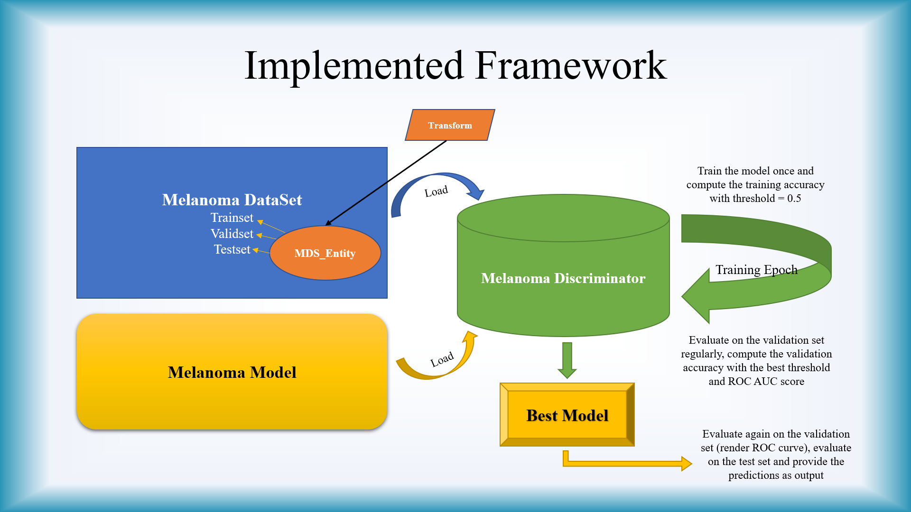

---

### Data Augmentation [Wang Ao]

​		Because our train set only has 748 pictures. We think it is not enough to train a model which has good performance. And We try to use data augmentation to expend our train set. 

##### Some Methods we have tried

​		We have tried some basic methods, such as **resize** the picture, **crop** the picture randomly, **flip** the picture, **rotate** the picture at a random angle.

​		What’s more, we also have tried **adding noise in picture and random masking** which means random selecting an area and setting the pixel to zero. 

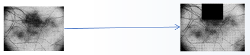

​		Above picture shows an example of random masking processing. After the processing of random masking, the top area of the picture turns black. 

​		We all know that the Hair on the skin has a bad impact on the diagnosis of skin diseases. And in order to reduce the difference of each pixel value to achieve image blur and smooth pixels. We also use the method of **Gaussian blur**. 

​				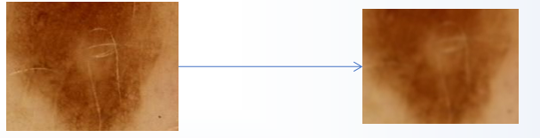			

​		Above picture shows an example of Gaussian blur processing. After the processing of Gaussian blur, hair has less effect on diagnosis.

​		And we also plan to **adjust the brightness and contrast** of picture, **add hair to the image**.

##### Test of Data Augmentation

​		After we apply the method of data augmentation to model training. We found that it can only improve performance slightly. Which means that if we only use data augmentation but do not select proper parameters, the performance will not be good. 

---

### Metadata [Wei Yanbin]

​	To aggregate the metadata into our project. We use a method which looks a little bit simply.

##### Encode the enum into numbers

​	First, encode the types of items value into a number. 

​	For columns in metadata csv, some of them has fixed several possible value like sex, it only has "male":"female":"(null) ". For this type of value, we can just encode them corresponding into "1":"0":"-1".  Similarly, the encode approach of  column "anatom_site_general_challenge" is as follows:

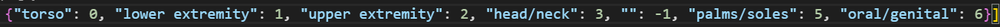

​	And for another type of column like age, the value is meaningful and is a number itself. So we can just use age as a input of the network for metadata.

##### Modify models to mix image path and metadata path

​	The module should be modified yet. And the method to mixed metadata and image parts are aggregate them into the same FC layer.

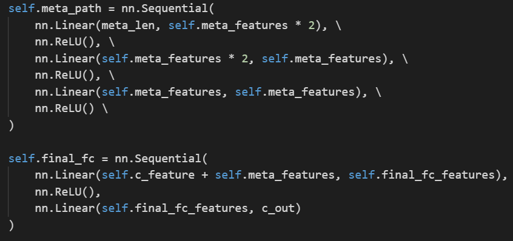

##### Infomation Leakage Hazard

​	There is a problem need to be noticed carefully during the metadata processing. That is when we use metadata csv given, some columns of them directly reveals the target of dataset, such as diagnosis, benign, may cause information leakage hazard. 

​	For more details, can refer to *Problems and Solutions* Part.

---

### Dataset Structure [Peter S]

The Melanoma Dataset contains three sets: the training set, the validation set and the test set. There will be two transformation functions separately for training and evaluating. The evaluation process uses the validation set to confirm and the test set to predict.

Each of these three sets is essentially an `MDS_Entity` instance, which inherits the PyTorch’s `Dataset` class and can be used to construct PyTorch’s `DataLoader`. When `MDS_Entity` is initialized, a list of sequential sample labels of images will be pre-processed so as to help with ROC AUC computations of the validation set as well as predictions on the test set. The number of positive samples and negative samples will also be counted in order to help find the best threshold for the model on the validation set.

One sample will contain information as follow:

-   A tensor processed from image transformations
-   A set of metadata (as a dictionary)
-   An ensemble tensor of the metadata, for training
-   The label/target value for the sample

---

### Model

#### Parameter Settings [Peter S]

We use different learning rates and image sizes to test our models. There are also three options for the optimizer: Adam, RMSprop and AdamW.

We use `BCEWithLogitsLoss` here as the criterion, since it is combined with a sigmoid unit as well as a `BCELoss` unit. The output from the model will be applied a sigmoid function to serve as probabilities. Probability values are between 0 and 1. That is why sigmoid function is used, rather than softmax or tanh (of course they can be used but sigmoid is more straightforward). And thus this is why `BCEWithLogitsLoss` is used rather than `CrossEntropyLoss`.

#### VGG [Wang Ao]

##### Structure of VGG16

​		I choose the network structure VGG16 to implement the binary classification. I refer to the VGG16 network structure in the slide of deep learning course.

​	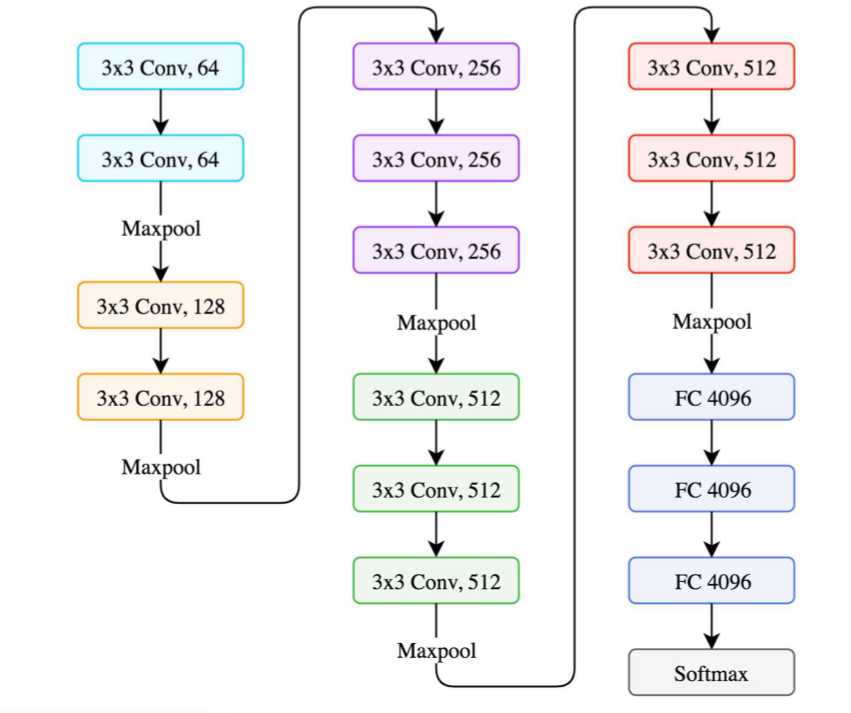

​		Above figure show the network structure of VGG16. This network structure has 6 parts. The first five parts are convolution parts and the last part is full connected part. And each convolution part consists of two or three convolution layers and one max pooling layer. Full connected part has three full-connected layers.

##### Performance of VGG16

​		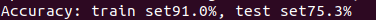

​		After training process. I found that the accuracy in train set can achieve 90% and the accuracy in test set can achieve 75%. I think there are some problems in my model.

#### VGG-Like CNN [Wei Yanbin]

##### Structure of VGG-Like CNN

​		A VGG-Like CNN model structure has been designed for the binary classification, which is based on what we used for our previous assignment 2. Besides, some modify has occurred so the model structure is as:

​		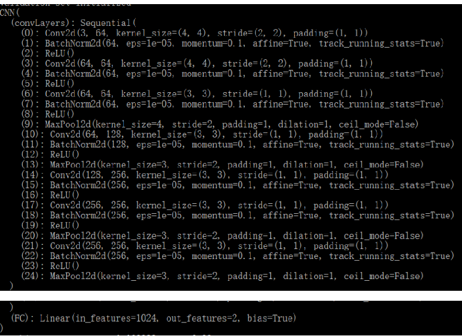

​		The structure of the model has 24 layers for 2D-convolution, max-pooling and ReLU activation, with a fully connected layer to do classification. 

​		After adding metadata, the model structure has a extra meta layer and FC connect them. 

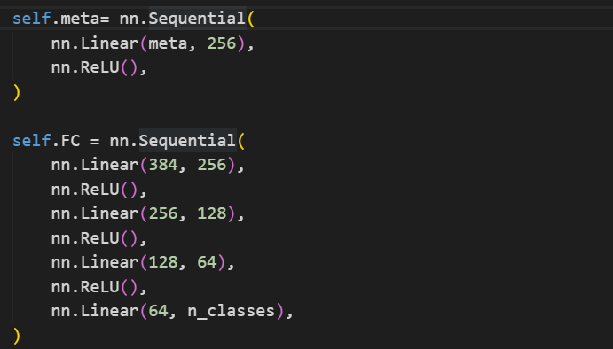

##### Hyper-parameters Tuning

​	Some hyper-parameters are of importance

	LEARNING_RATE_DEFAULT = 1e-4
	
	BATCH_SIZE_DEFAULT = 64
	
	MAX_EPOCHS_DEFAULT = 3000
	
	EVAL_FREQ_DEFAULT = 5
	
	USING_GPU_DEFAULT = True
	
	DATA_AUGMENTATION_DEFAULT = False
	
	THREADS_DEFAULT = 8	

##### Performance

| Model                   | Validation Set Accuracy | ROC-AUC |
| ----------------------- | ----------------------- | ------- |
| Like-VGG CNN            | 76 % ~ 80 %             | 81.78 % |
| Like-VGG CNN(with meta) | 73 % ~ 81 %             | 83.71 % |

#### ResNet/ResNeXt [Peng Weiyuan]

##### ResNet 

A residual learning framework to ease the training of networks that are deeper than those used previously. ResNet archives the SOA performance in 2016, and get the best paper awards in CVPR 2016.


##### ResNeXt

ResNeXt is a simple, highly modularized network architecture for image classification. This network is constructed by repeating a building block that aggregates a set of transformations with the same topology. ResNeXt archives the SOA performance in 2018, so choosing ResNeXt as the basic model may give some performance improvement.


##### Basic Model Selection

Because the dataset is not as big as hundreds of GBs like the original Melanoma dataset. The too big model will cause overfitting and training too slow.
Small models like ResNet-50 and ResNeXt-50 are good chooses, they are not too big but still have good performance in testing.

#### EfficientNet [Peter S]

EfficientNets are a family of image classification models, which achieve state-of-the-art accuracy, yet being order-of-magnitude-smaller and faster-than-previous models. The EfficientNets are developed based on AutoML and Compound Scaling.

<table>
    <tr>
    	<td></td>
    	<td></td>
    </tr>
</table>


From the figures shown above, we see that the training accuracy of EfficientNets seem to achieve much better results than other classification models (such as ResNet/ResNeXt) and the outcome is more obvious as the number of parameters or the number of FLOPS increases. Generally speaking, when picking models for image classification as a start, EfficientNet seems to always be a nice choice.

For this project, considering the GPU resources we can consume, only EfficientNet-b1 with image input size as 240 is used. Additionally, from the Kaggle Notebook of the project, there are certain articles suggesting that a pooling layer as well as a dropout layer are used.

The model is constructed simply as follow:

```pseudocode
EfficientNet-b1
Adaptive_Avg_Pool2d(output_size=1)
Dropout(p=0.2)
Linear(x, 1)
```

If the metadata is used, it will go through these layers:

```pseudocode
Linear(meta_len, meta_features * 2)
ReLU()
Dropout(p=0.2)
Linear(meta_features * 2, meta_features)
BatchNorm1d(meta_features)
ReLU()
Dropout(p=0.2)
```

The two outputs will be concatenated and passed through these layers:

```pseudocode
Linear(efnet_features + meta_features, final_fc_features)
ReLU()
Dropout(p=0.2)
Linear(final_fc_features, 1)
```

The metadata layers and the final fully-connected layers are designed in a very simple way, since EfficientNet is already huge for training.

---

### Training/Evaluation Process [Peter S]

The training-validation process is as follow:

-   At each epoch, the model is trained on the training set once. The training accuracy under threshold = 0.5 and the general training loss are computed
-   In the meantime, at each evaluation epoch, the model will accept data from the validation set. The validation accuracy under the computed best threshold as well as the ROC AUC score are calculated. The model under current status will be saved to local as the best model as long as the following conditions are satisfied:
    -   The training accuracy for this epoch is not below 90%
    -   The ROC AUC score for the validation set is better than historical record

The evaluation process is as follow:

Evaluate using saved best model (Note that this is a Test API)

1. Re-evaluate on the validation set
2. Find the ROC AUC score
3. Plot the ROC curve
4. Find the optimal threshold for the model/network
5. List the misclassified images in the validation set
6. Use the optimal threshold to predict the test set

---

### Results

The results below all use AdamW with learning rate as 0.0001 and are recorded as the training results become relatively steady. Note that the ROC AUC score and the accuracy are all on the validation set:

|              Model              |  ROC AUC   |  Accuracy  |
| :-----------------------------: | :--------: | :--------: |
|             **VGG**             |   75.30%   |  70%~75%   |
|        **VCG-Like CNN**         |   81.78%   |  76%~80%   |
|  **VCG-Like CNN (with meta)**   |   83.71%   |  73%~81%   |
|          **ResNeXt50**          |   90.44%   |  80%~87%   |
|    **ResNeXt50 (with meta)**    |   89.39%   |  74%~85%   |
|       **EfficientNet-b0**       |   92.05%   | Around 83% |
| **EfficientNet-b0 (with meta)** | **92.13%** |  75%~88%   |

From the results we find that the model with the best ROC AUC score is the EfficientNet with metadata ensemble. The result reaches 92.13% which seems good. For the best threshold set as 0.3955, the validation accuracy reaches 88.71% which is so far the highest. The final `test.csv` is thus predicted using this model.

#### ROC curves

-   VGG-Like CNN

    <table>
        <tr>
        	<td align=center>
                <figure>
                	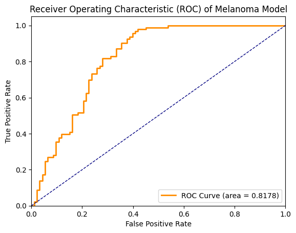
                    <figcaption>VGG-Like CNN</figcaption>
                </figure>
            </td>
        	<td align=center>
                <figure>
                	
                    <figcaption>VGG-Like CNN (With meta)</figcaption>
                </figure>
            </td>
        </tr>
    </table>

-   ResNeXt

    <table>
        <tr>
        	<td align=center>
                <figure>
                	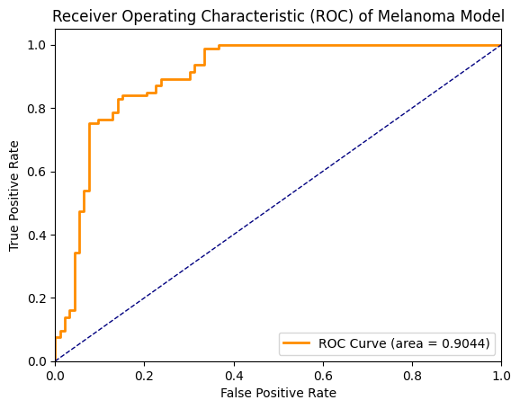
                    <figcaption>ResNeXt</figcaption>
                </figure>
            </td>
        	<td align=center>
                <figure>
                	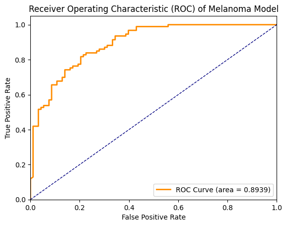
                    <figcaption>ResNeXt (With meta)</figcaption>
                </figure>
            </td>
        </tr>
    </table>

-   EfficientNet

    <table>
        <tr>
        	<td align=center>
                <figure>
                	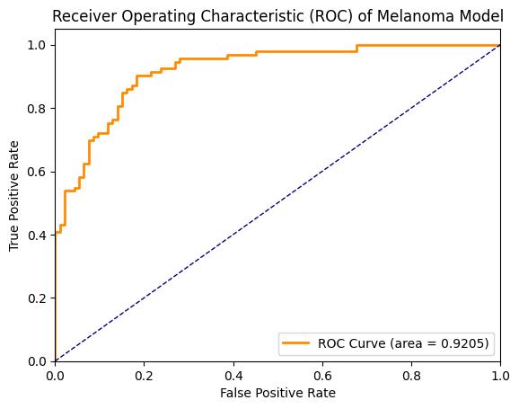
                    <figcaption>EfficientNet</figcaption>
                </figure>
            </td>
        	<td align=center>
                <figure>
                	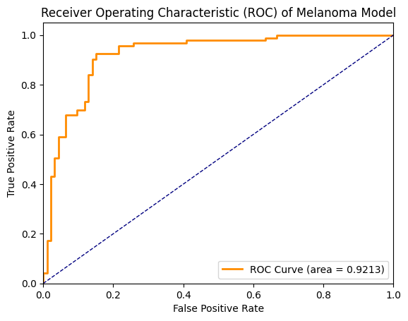
                    <figcaption>EfficientNet (With meta)</figcaption>
                </figure>
            </td>
        </tr>
    </table>

As we can see, ResNeXt and EfficientNet tend to have higher true positive rates when the false positive rates are low. From the curves, EfficientNet with metadata obtains the largest AUC among all.

---

### Problems & Solutions

-   **[Peter S] For the metadata, there are some empty values in the csv files. How to deal with them?**

    There are two probable ways to handle empty values for these csv files. The first approach is to ignore them. For the metadata ensemble tensor, if empty values occur, the tensor will not receive any 1s. The second approach is to balance the data, by applying meaningful values that show up with the smallest frequency.

-   **[Peter S] Some images have their own noise features. For example, in the training set there are some images that contain lots of hairs (e.g., `img_150.jpg`), which become certain noises. There are also some images retrieved using some sort of telescopic methods (e.g., `img_195.jpg`), whose surrounding white areas are needless. How to utilize the model to learn about these “extra” features (distinguish from these noises)?**

    <table>
        <tr>
        	<td align=center>
                <figure>
                	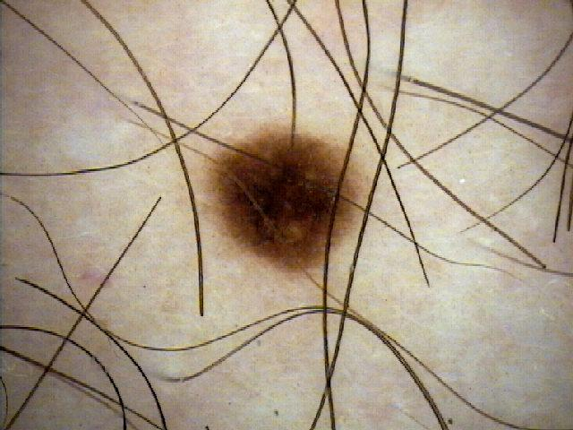
                    <figcaption>img_150.jpg</figcaption>
                </figure>
            </td>
        	<td align=center>
                <figure>
                	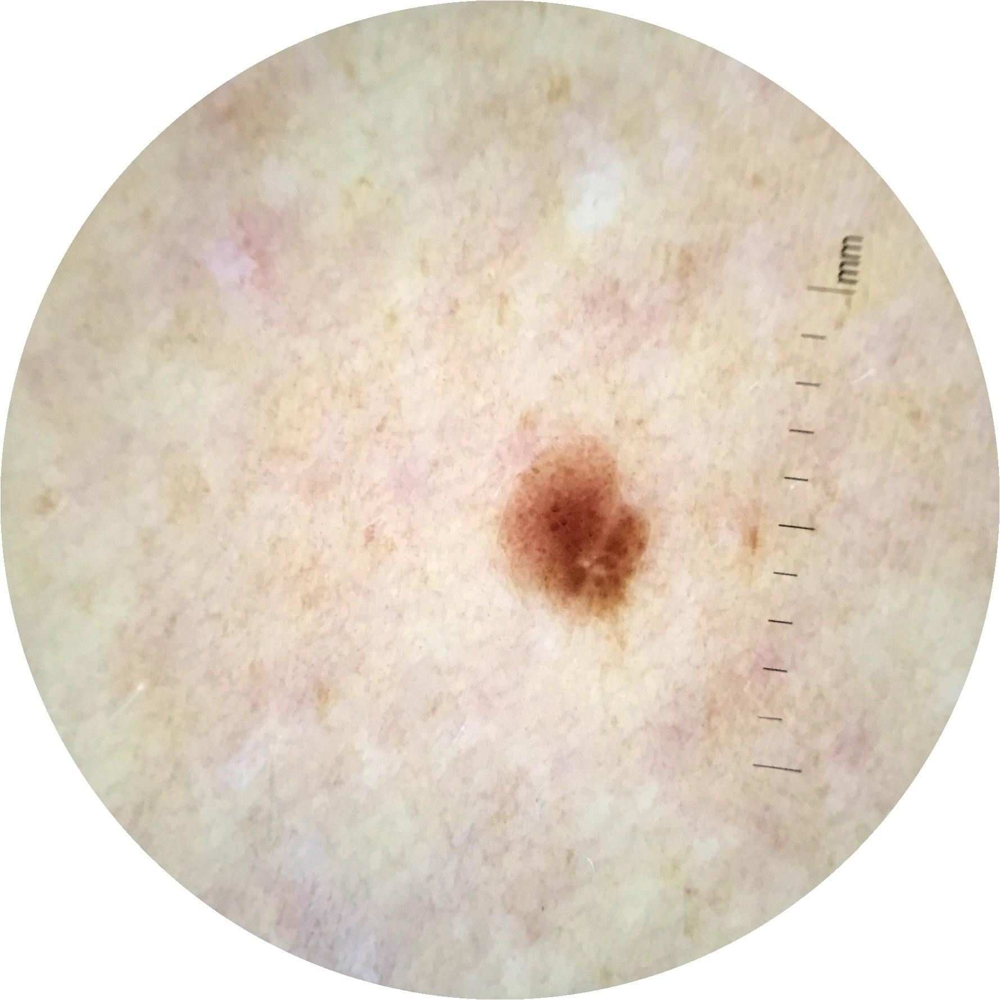
                    <figcaption>img_195.jpg</figcaption>
                </figure>
            </td>
        </tr>
    </table>


```pseudocode
Use certain data augmentation skills. For hair noises, use `DrawHair` function which draws a random number of pseudo-hairs in the sample image. For telescope images, use `CenterCrop` or `RandomCrop` to crop out the white regions.
```

-   **[Peter S] When considering accuracy on the validation set, it matters which value (threshold) we choose to split the predictions of positive or negative samples. How to compute the best threshold, which can give us the highest accuracy?**

    There are lots of standards to compute the best threshold on. Simply, we use accuracy, which is the number of correctly predicted samples divided by total number of samples. Of course, we can also use precision (I have successfully identified lots of melanomas) or recall (My claims on the melanomas are mostly correct).

-   **[Peter S] Why does EfficientNet achieve a much better performance after the learning rate is changed from 0.001 to 0.0001 and the AdamW optimizer is used instead of Adam or RMSprop?**

    For the learning rate, it seems that 0.001 is too large for the model and it keeps wandering around the theoretically best status. Its behavior is like the figure shown below:

    

    AdamW acts partially as a simpler version of Adam and it corrects the wrong implementations of Adam on multiple platforms. From the figure below we can see that AdamW performs better than Adam on both training loss and test error. The effect gets even more obvious as the epoch increases:

    

    As for RMSprop, it seems to keep the training process more steady (with less fluctuations of accuracy values). However, Adam or AdamW have momentum to control this as well. The reason that RMSprop was better than Adam in the tests before might be that the learning rate 0.001 is too high so that the model jumps around more easily.

-   **[Wang Ao] GPU resources are not enough when training VGG16?**

    When I tried to train the model on the server. There was always exception that GPU out of memory. So I have to select some network layers and delete them. And I think this may lead to the bad performance of VGG16.

-   ##### [Wei Yanbin] Information Leakage Hazard

    ​	There is a problem need to be noticed carefully during the metadata processing. That is when we use metadata csv given, some columns of them directly reveals the target of dataset, such as diagnosis, benign, may cause information leakage hazard. 

    ​	**Problem Phenomenon**: Model can perform similar perfect on validation set. But it is because of Information leakage !  

    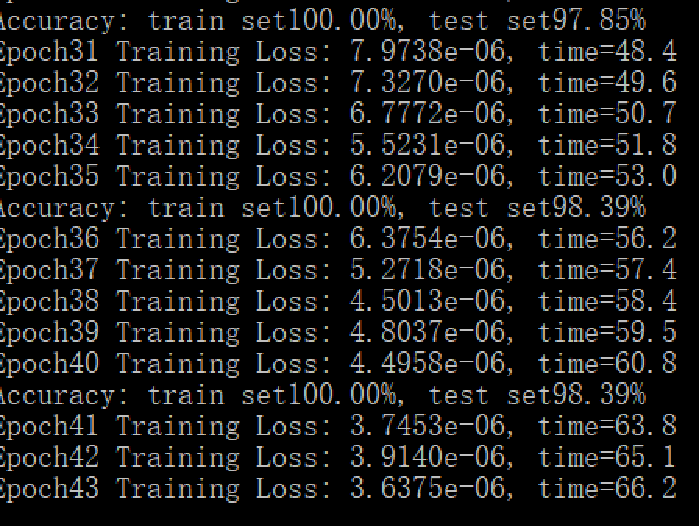

    ​		**Analysis**：The abnormal performance is caused by the two columns in csv of the meta_data, which reveal the target appearently. 

    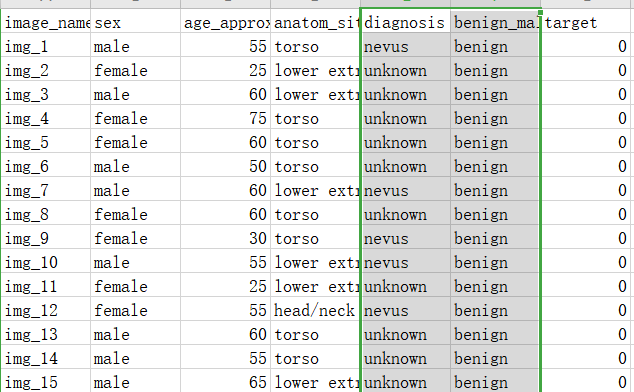

    ​		**Solution**:  To avoid the Information leakage. Only use sex age_approx and anatom.. Then the performance looks normal.

<br>

## Extra Contents

### ROC & AUC

This part is already discussed in [Results](#Results).

---

### Misclassified Images in the Validation Set [Peng Weiyuan]

In the final validate process, 21 (of 186) images in validation set are misclassified.

#### Confusion Matrix

In these 21 photos, 14 are false-negative and 7 are false-positive.

- **False-Negative**: malignant sample been misclassified as benign.

- **False-Positive**: benign sample been misclassified as malignant.


We can see the number of false-negative is 2x of false positive, which means that the threshold of the model is still too high, predicting a large number of negative samples as positive. 

If we want to improve the performance of the model, we can consider decreasing the threshold in model classification.

However, this threshold (0.3955 here) is calculated through the ROC analysis in the training process. Theoretically, the best threshold is reached on the training set. 

So, a possible reason is that the **data set is too small**, there is still a big difference between the training set and the validation set, and it is difficult to achieve the same result. Or some other accidental factors caused by the insufficient data set.

#### Unclear image

By seeing there misclassified images one by one, I found some of them are unclear image,

##### Hair

For example:


In these 2 images, they both have very obvious hairs and the number of hairs is much bigger the fake hair we draw in data augmentation (0 to 2 hairs). These kinds of sample are very hard to classify.

##### Other Unclear Image


The background of this sample is round, not square like other samples. We tried to add such samples by cropping the image in data augmentation but maybe there are still not enough samples like this, which caused the model classification error.


This image is too different from other samples. I think this is because of a wrong shot. The model does not have the ability to classify this kind of image, it can only guess.

#### Conclusion

The threshold greatly affects the final accuracy of the model. A too high threshold may cause many positive samples to be classified as negative. Using ROC to find the best threshold can solve this problem. However, while the dataset is too small, the best threshold on the training set and validation set may be different.

Some of the images in the dataset are unclear and they may be misclassified very easily. For example, Some images have lots of hairs, and others may be a round background. 

We can reduce the error rate of predicting those unclear images by doing data augmentation. If we can simulate those unclear images and add them to the training set, the model will correctly classify those unclear images.

